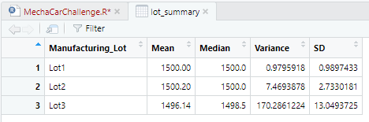

# MechaCar_Statistical_Analysis
## Linear Regression to Predict MPG
Using Rstudio, we will answer the following questions.
- Which variables/coefficients provided a non-random amount of variance to the mpg values in the dataset?
    - Vehicle weight spoiler angle and and AWD have p values, greater than 0.05.
- Is the slope of the linear model considered to be zero? Why or why not?
    - The multiple R-squared value is 0.7, the linear model is not near zero.
- Does this linear model predict mpg of MechaCar prototypes effectively? Why or why not?
    - Overall, this linear model has a significance value lower than 0.05, which suggest that there is a strong chance that the results produced were by chance.

## Summary Statistics on Suspension Coils
The design specifications for the MechaCar suspension coils dictate that the variance of the suspension coils must not exceed 100 pounds per square inch.
- Does the current manufacturing data meet this design specification for all manufacturing lots in total and each lot individually? Why or why not?
    - When we look at the total summary table, we can see that all coils meet the expectation of not exceeding the 100 PSI limit.  
  
    - However, when we inspect each lot indicidually we can see that Lots 1 and 2 meet the requirement but not Lot 3.

    - Lot 3 coils should not be used during the MecaCar production as they have a variance of 170 PSI.
## T Tests on Suspension Coils
For the entire coil table we have a p-value of 1 which suggests that there is a significant difference from the true mean of the entire pupolation.

After looking at the p values for each individual lot we get a different story. For lot 1 we found a p-value of 1.5618e-11, which suggests that coils from lot 1 are at the true mean of the population.

For lot 2 we found a p-value of 0.0005911, which suggest that coils from lot 2 are very close to the true mean of the population. 

For lot 3 we found a p-value of 0.1589, this value is greater that our significance value of 0.05, which suggests that coils from lot 3 are far from the true mean of the entire population.

From these results, we learned that coils from lot 3 alone, have a big influence on the overall p-value of the entire population.